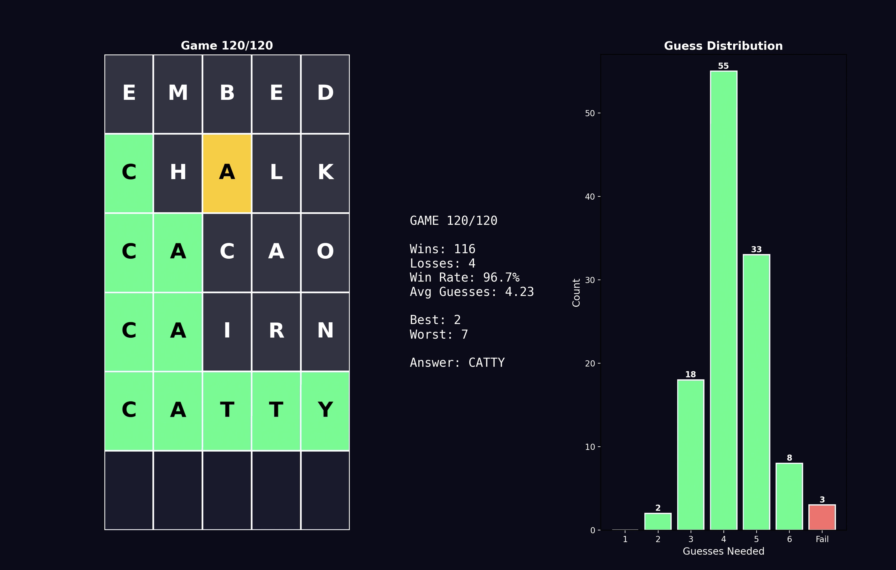

# Wordle DQN — Deep Q-Network from Scratch

A from-scratch Deep Q-Network that learns to play Wordle through reinforcement learning. Trained on 100,000 episodes with no ML frameworks — just NumPy and the math. Achieves a 96.8% win rate across all 2,315 Wordle answers, averaging 4.20 guesses per win.



## Project Structure

```
├── NeuralNetwork.py         # DQN class (forward + backward)
├── train.py                 # Training loop with TD learning
├── test.py                  # Evaluate trained model + interactive play
├── plot.py                  # Animated dashboard (board + stats + histogram)
├── data/
│   ├── valid_guesses.csv    # 10,657 valid Wordle guesses
│   ├── valid_solutions.csv  # 2,315 possible Wordle answers
│   └── wordle_dqn.npz      # Saved model weights
├── plot/
│   └── DQNplot.png          # Performance visualization
└── README.md
```

## How It Works

### The DQN Architecture

```
Input:  130-dim state vector (5 positions × 26 letters)
        Encodes probability distribution over remaining possible words
        Each value = "what's the chance this letter is in this position?"

Hidden: 128 units (ReLU) → 256 units (ReLU)

Output: Q-values for all 10,660+ valid guesses
        Higher Q = better expected outcome from this guess
```

### State Encoding

After each guess and feedback, the remaining possible answers are filtered. The state vector captures the uncertainty at each position:

```python
def encode_state(possible):
    state = np.zeros(5 * 26)  # 130 zeros
    for word in possible:
        for pos, char in enumerate(word):
            idx = pos * 26 + (ord(char) - ord('a'))
            state[idx] += 1
    return state / len(possible)
```

### Training (Temporal Difference Learning)

```
For each episode (game):
    1. Play a full game with epsilon-greedy action selection
    2. Store every (state, action, reward, next_state)
    3. Update backward through the episode:
       target = reward + γ × max(Q(next_state))
       loss = (target - Q(state, action))²
       backprop through the network
```

- **Reward**: +10 for solving, -1 per guess
- **Gamma**: 0.9
- **Epsilon**: 1.0 → 0.05 (decay 0.99995 per episode)
- **Learning rate**: 0.001
- **Episodes**: 100,000

## Results

| Metric | Value |
|--------|-------|
| Win Rate | 96.8% (2,240 / 2,315) |
| Average Guesses (wins) | 4.20 |
| Best Guess Distribution | 4 (most common) |
| Failures | 75 / 2,315 (3.2%) |

### Comparison

| Solver | Win Rate | Avg Guesses |
|--------|----------|-------------|
| Random | ~0% | — |
| **DQN (this project)** | **96.8%** | **4.20** |
| Entropy (mathematically optimal) | 100% | ~3.5 |
| WordleBot (NYT) | 100% | ~3.4 |

The DQN independently learned strategies like:
- "Guess a word that can't be the answer but tests five new letters"
- "When only three possibilities remain, guess directly rather than exploring"
- "Prioritize vowels and common consonants in early guesses"

No information theory. No hand-crafted heuristics. Just rewards and backprop.

## Usage

### Training

```bash
python train.py
```

### Evaluation

```bash
python test.py
```

### Interactive Play

```python
# Uncomment the interactive function in test.py
play_wordle_myself(model)
# Enter feedback as: 2,0,1,0,0 (green=2, yellow=1, gray=0)
```

### Animated Dashboard

```bash
python plot.py
```

Shows a live 3-panel dashboard: Wordle board with colored tiles, running stats (win rate, avg guesses), and an updating histogram of guess distribution.

## Lessons Learned

### The Vocabulary Bug
The hardest bug: `possible` was filtered from `answers` (2,315 words), but `word_to_idx` was built from `valid_words` (10,657 words). When a guess narrowed possibilities to a word not in the vocabulary mapping, the code crashed with `KeyError`. Fix: combine both lists into one unified vocabulary.

### Reward Sparsity
Early training was almost all failures (reward = -6). The model rarely saw +10. Fix: neutral per-step reward (0 instead of -1) and epsilon decay slow enough to allow some wins to propagate.

### Hardcoded Dimensions
Every `10658` in the code was a time bomb. When the vocabulary size changed, everything broke. Fix: `self.n_words` stored once, used everywhere.

## Dependencies

```bash
pip install numpy pandas matplotlib
```

## Inspiration

Built after watching the first few lectures of Stanford's CS234 (Reinforcement Learning). The DQN algorithm was implemented from the TD-learning equations — no PyTorch, no TensorFlow, no RL libraries.
